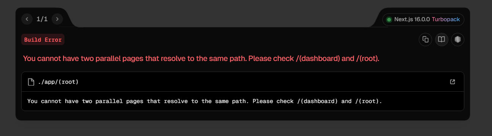

# Next.js Learning Journey 📚

A comprehensive guide documenting my learnings while building Next.js applications. This README will be continuously updated as I explore more features and concepts.

---

## Table of Contents
- [Route Groups](#route-groups)
  - [What are Route Groups?](#what-are-route-groups)
  - [Creating Route Groups](#creating-route-groups)
  - [Parallel Pages and Conflicts](#parallel-pages-and-conflicts)
  - [Use Cases](#use-cases)
  - [File Structure Example](#file-structure-example)

---

## Route Groups

### What are Route Groups?

Route Groups are a powerful organizational feature in Next.js that allow you to group related routes together **without affecting the URL structure**. By wrapping a folder name in parentheses `(folderName)`, you create a route group that helps organize your code while keeping URLs clean.

**Key Benefits:**
- 📁 Better project organization
- 🎯 Logical grouping of related routes
- 🔄 Shared layouts for specific route segments
- 🚫 No impact on the URL path

---

### Creating Route Groups

To create a route group, wrap the folder name in parentheses:
```
app/
├── (dashboard)/
│   ├── home/
│   │   └── page.tsx      → renders at /home
│   └── about/
│       └── page.tsx      → renders at /about
└── (marketing)/
    ├── contact/
    │   └── page.tsx      → renders at /contact
    └── pricing/
        └── page.tsx      → renders at /pricing
```

**Without route groups**, the URLs would be:
- `/dashboard/home`
- `/dashboard/about`

**With route groups** `(dashboard)`, the URLs become:
- `/home`
- `/about`

The `(dashboard)` segment is **completely omitted** from the URL!

---

### Parallel Pages and Conflicts

#### Understanding the Root Route (`/`)

When using route groups, you can place a `page.tsx` file inside any route group to handle the root path (`/`). However, **you cannot have multiple `page.tsx` files in different route groups that resolve to the same path**.

#### Example Error:
```
app/
├── (dashboard)/
│   └── page.tsx         → resolves to /
└── (root)/
    └── page.tsx         → also resolves to /
```

**This will cause an error:**
```
Error: You cannot have two parallel pages that resolve to the same path.
Please check /(dashboard) and /(root).
```



#### Solution:

Only include one `page.tsx` at the root level within route groups:
```
app/
├── (dashboard)/
│   ├── page.tsx         → ✅ resolves to /
│   ├── home/
│   └── about/
└── (marketing)/
    ├── contact/
    └── pricing/
```

---

### Use Cases

#### 1. **Separating Application Sections**
```
app/
├── (admin)/
│   ├── layout.tsx       → Admin-specific layout
│   ├── users/
│   └── settings/
└── (public)/
    ├── layout.tsx       → Public-facing layout
    ├── blog/
    └── about/
```

#### 2. **Different Authentication States**
```
app/
├── (authenticated)/
│   ├── layout.tsx       → Requires authentication
│   ├── dashboard/
│   └── profile/
└── (guest)/
    ├── layout.tsx       → Public access only
    ├── login/
    └── signup/
```

#### 3. **Shared Layouts Within Groups**
Each route group can have its own `layout.tsx` that applies to all routes within that group:
```
app/
├── (dashboard)/
│   ├── layout.tsx       → Shared dashboard layout (sidebar, header)
│   ├── analytics/
│   ├── settings/
│   └── reports/
└── (marketing)/
    ├── layout.tsx       → Shared marketing layout (navbar, footer)
    ├── features/
    └── pricing/
```

---

### File Structure Example

Here's a complete example showing how route groups organize a project:
```
app/
├── (dashboard)/
│   ├── layout.tsx                 → Dashboard layout with sidebar
│   ├── page.tsx                   → Dashboard home at /
│   ├── analytics/
│   │   └── page.tsx               → /analytics
│   ├── users/
│   │   └── page.tsx               → /users
│   └── settings/
│       └── page.tsx               → /settings
│
├── (marketing)/
│   ├── layout.tsx                 → Marketing layout with navbar
│   ├── features/
│   │   └── page.tsx               → /features
│   ├── pricing/
│   │   └── page.tsx               → /pricing
│   └── about/
│       └── page.tsx               → /about
│
└── api/
    └── users/
        └── route.ts               → /api/users
```

**Benefits of this structure:**
- Clear separation between dashboard and marketing sections
- Each section has its own layout and styling
- URLs remain clean without `dashboard` or `marketing` prefixes
- Easy to maintain and scale

---

## Additional Resources

- [Next.js Route Groups Documentation](https://nextjs.org/docs/app/api-reference/file-conventions/route-groups)
- [Next.js Routing Fundamentals](https://nextjs.org/docs/app/building-your-application/routing)

---

## Notes for Future Updates

This README will be expanded as I continue learning. Upcoming topics may include:
- Dynamic routes
- API routes
- Middleware
- Server and Client Components
- Data fetching strategies
- And more...

---

**Last Updated:** [Oct 23 , 2025]

**Project Status:** 🚧 Actively Learning